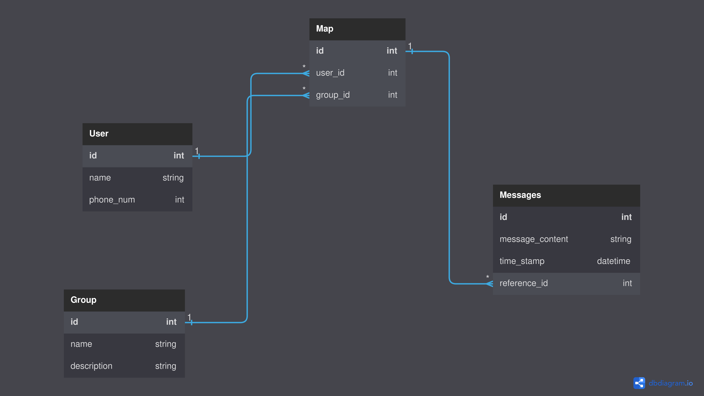

To run the API install `docker` and `docker-compose`, then inside the repository run:

```docker-compose up```

The API has 6 endpoints:

1. `POST /user` to create a user
2. `POST /group` to create a group
3. `POST /group_add_user` to add a user to a group
4. `POST /messages` to post message of a user to a particular group
5. `GET /messages` to get messages of a user sent in a particular group
6. `GET /messages_group` to get all messages sent by all users in a particular group

Database Schema



Schema for each endpoint
1. Inside body:
    ```
    {
        name: ###,
        phone_num: ###,
    }
2. Inside body:
    ```
    {
        name: ###,
        description: ###
    }
    ```
3. Inside body: 
    ```
    {
        group_id: ###,
        user_id: ###
    }
    ```
4. Inside body:
    ```
        user_id: ###,
        group_id: ###,
        msg_content: ###
    ```
5. In query params:
    ```
    key         value

    user_id     ###
    group_id    ###
    page        ###
    limit       ###
    ```
6. In query params:
    ```
    key         value

    group_id    ###
    page        ###
    limit       ###
    ```